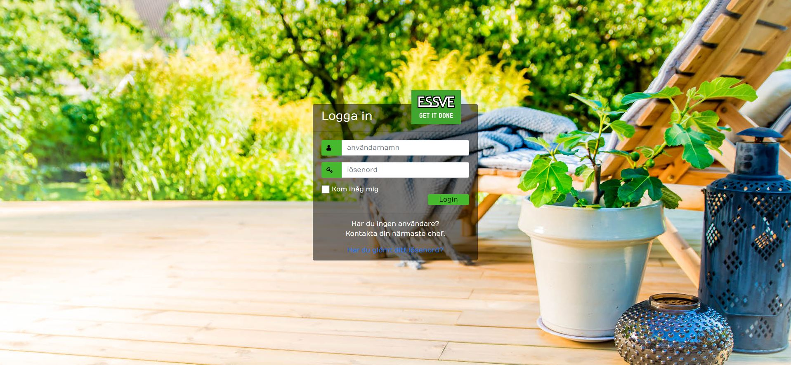

https://bootsnipp.com/snippets/vl4R7
https://codeshack.io/secure-login-system-php-mysql/

### Product management Tool for ESSVE

Welcome to my Product management Tool for ESSVE,
To provide easy navigation and access to products that isn't for sale, I've created this Tool.
It's like an e-commerce without the buying functionality.

## UX

I've created this website so that the staff of ESSVE can locate products and the product information, in an easy matter. This regards only products for internal usage, like interior, give-aways, brochures, etc.

*It has an easy navigational layout with a reacurring structure for easy use.
*It presents the products devided into categories, in a easy to understand and overview manner.
*It will have filtering functions and search-functions. allthough these isn't finished yet.
*It will also be possible to create "shopping-lists" from here and generate a excel or pdf to use when placing an order.

I have been working at ESSVE for almost 7 years as a customer service representative and it has always been a struggle to locate this type of products for us and our sales staff.
It was clear to me that this is what I had to create once I got some knowledge of JavaScript.

I started of making a list of all the futures that I needed, Which now is included although not all done.

It was clear to me how the layout would look so I skipped over the wireframe-part, also concidering I needed to convince noone this was a good idea.

I have focused on the overall functionallity before the layout so have indulgence, this is a (for me) huge and ongoing project.

## Features

### Existing Features:
* A login page so only those who should have access is the only ones that gets access. Managed by PHP and MySQL.
* Category filtering based on properties of the product. Managed by JavaScript.

### Future Features to be included:
* A searchbar to search for products.
* Product filters.
* A nice profile page from where one can manage change of personal information.
* The ability to create a shopping list by adding products from the site or product pages.
* I'm hoping to be able to add the possability to generate product shelf labels as well.

## Technologies Used

* [HTML5](https://html.spec.whatwg.org/) - for content.
* [CSS](https://www.w3.org/Style/CSS/) - for styling.
* [JavaScript](https://www.javascript.com/) - for the logics.
* [PHP](https://www.php.net/) - for the login authentification.
* [JSONBin.io](https://jsonbin.io/) - for the database and the API.
* [MySQL](https://www.mysql.com/) - the database for managing user credentials.
* [Bootstrap](https://getbootstrap.com/) - for easy creating the overall layout and functions.
* [Font Awesome](https://fontawesome.com/) - for inclusion of icons.
* [Jquery](https://jquery.com/) - to simplify DOM manipulation.

## Testing

I've been running Quokka and prettier extensions on VS Code for troubleshooting and arranging code.
Because it's not more code than I can manage myself I've been satisfied by running the validators JSHint, freeformater and css-validator. I've also used the debugger in Chrome to step through all lines of JavaScript Code.

All testing has been done manually by me, except the validating. And I'm picky, so rest a sure I'll always do anything in my power to deliver a properlly working site.
All testing is done sequential, and structured.

## Deployment

I installed Apache2 tougheter with MySQL and PHP on a Raspberry Pi and setup DynDNS on my router. 

## Credits

### Content:

* Code Institute projects 'Bootstrap Intro' and the 'UCD Resume' for some styling.

### Media:

* Code Institute project 'Bootstrap Intro' for the background of all pages.

### Acknowledgements:

* Code institue for giving me the knowledge I've recieved so far.
* My mentor Mr. Sandeep Aggarwal for his insights.
* All friends and acquaints for all the support.